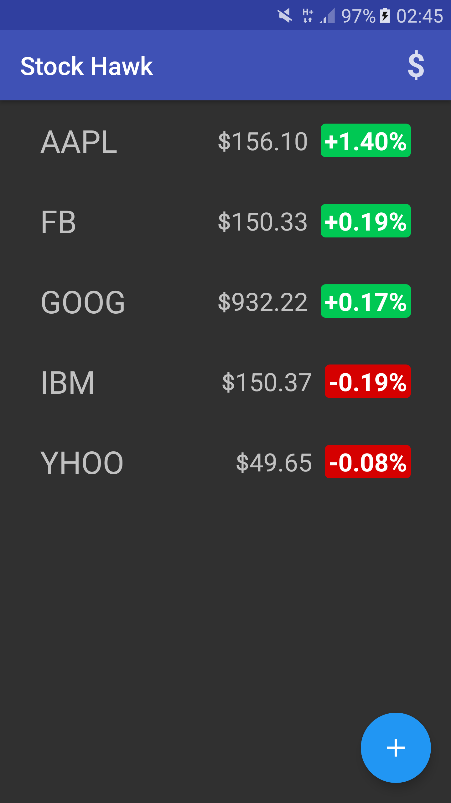
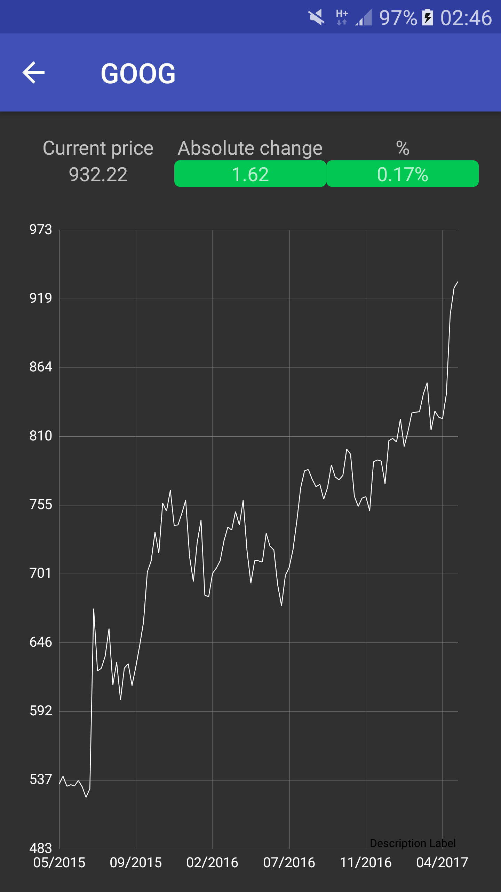
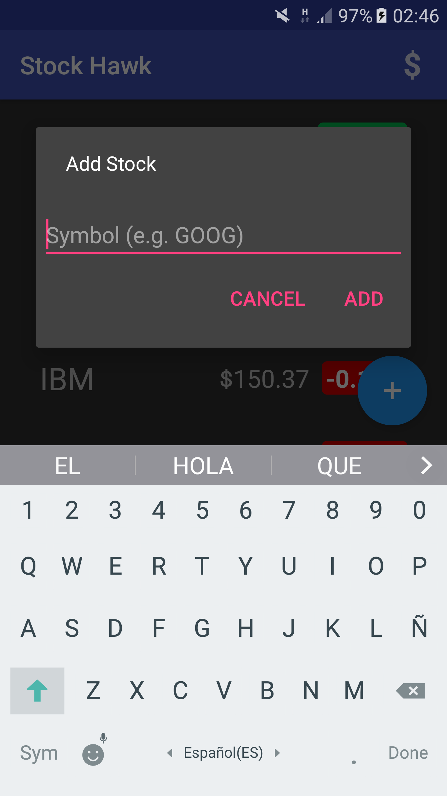
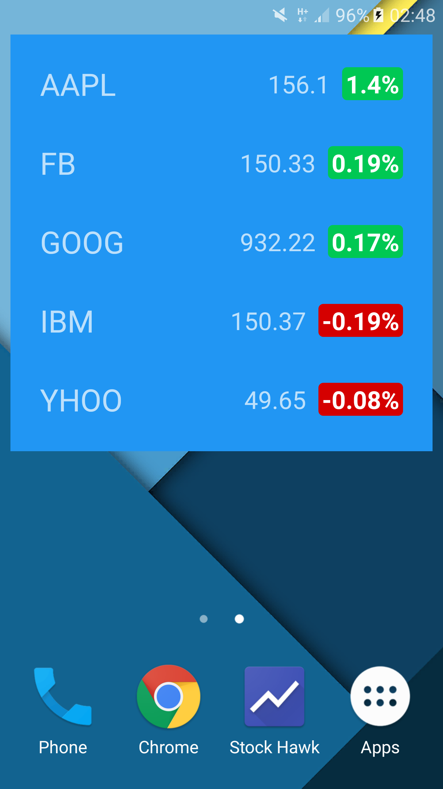

# Udacity-Stage3
Stage 3: Stock Hawk

# Meets Expecifications
The app will:
* Each stock quote on the main screen is clickable and leads to a new screen which graphs the stock's value over time.
* Stock Hawk does not crash when a user searches for a non-existent stock.
* Stock Hawk Stocks can be displayed in a collection widget
* Stock Hawk app has content descriptions for all buttons.
* Stock Hawk app supports layout mirroring using both the RTL attribute and the start/end tags.
* Strings are all included in the strings.xml file and untranslatable strings have a translatable tag marked to false.

# Developed By

* Jota Ramirez - <jotaramirez90@gmail.com>

# License
	Copyright 2017 Jota Ramirez

	Licensed under the Apache License, Version 2.0 (the "License");
	you may not use this file except in compliance with the License.
	You may obtain a copy of the License at

		http://www.apache.org/licenses/LICENSE-2.0

	Unless required by applicable law or agreed to in writing, software
	distributed under the License is distributed on an "AS IS" BASIS,
	WITHOUT WARRANTIES OR CONDITIONS OF ANY KIND, either express or implied.
	See the License for the specific language governing permissions and
	limitations under the License.

